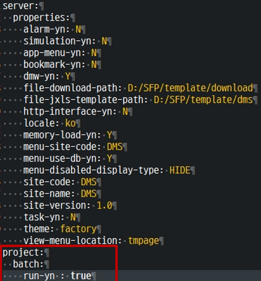
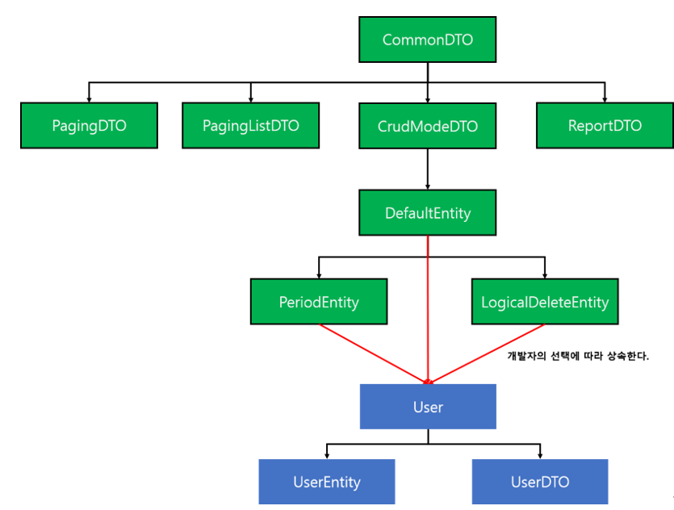

## 1.7	intrfc
외부 시스템과 인터페이스 API 통신을 진행하기 위해 필요한 클래스를 구현한다.
<br><br>


## 1.8	batch
batch package는 프로젝트에서 사용하는 스케줄러를 관리하는 package이다.
configprops.yml 파일에 스케줄러를 동작 여부를 제어하는 프로퍼티 run-yn을 Boolean값으로 설정한다.

<br>


<br><br>

## 1.8.1 구현예시(Class 제어)

TASK 클래스의 구성 프로그램은 다음과 같다.<br>

|path| com.s3s.solutions.manager.batch
|------|---

TaskExample.java
```java
@Slf4j
@TaskRunable("project.batch.run-yn")
public class TaskExample {

	@Scheduled(initialDelay = 1000 * 15, fixedDelay = 1000 * 15)
	public void doTask1() {
		log.info("==========Hello SFP1===========");		
	}

	@Scheduled(initialDelay = 1000 * 15, fixedDelay = 1000 * 15)
	public void doTask2() {
		log.info("==========Hello SFP2===========");
	}

}
```
위와 같이 클래스 상단에 @TaskRunable 어노테이션을 설정한 경우에는 모든 메소드가 run-yn의 여부에 따라 동작이 제어되며 콘솔 화면의 실행은 아래와 같다.

결과
```java
INFO : ==========Hello SFP1===========
INFO : ==========Hello SFP2===========
```
<br><br>

## 1.8.2 구현 예시(Method 제어)
TASK 클래스의 구성 프로그램은 다음과 같다.

configprops.yml
```yml
project:
batch:
  run-yn: false
```
run-yn의 값이 false로 설정한 상태이다.
<br><br>

|path| com.s3s.solutions.manager.batch
|------|---

TaskExample.java
```java
@Slf4j
public class TaskExample {

    @TaskRunable("project.batch.run-yn")
	@Scheduled(initialDelay = 1000 * 15, fixedDelay = 1000 * 15)
	public void doTask1() throws Exception{
		log.info("==========Hello SFP1===========");		
	}

	@Scheduled(initialDelay = 1000 * 15, fixedDelay = 1000 * 15)
	public void doTask2() throws Exception{
		log.info("==========Hello SFP2===========");
	}
}
```

결과
```java
INFO : ==========Hello SFP2===========
```
run-yn false 로 선언 되어있으므로 첫번째 메소드의 경우는 실행이 되지 않았으며 두번째 메소드의 경우에는 제어권을 벗어나 진행을 하게 된다.
메소드만 제어를 하는 경우에는 다른 메소드는 영향을 받지 않기 때문에 이는 개발자가 여러 상황을 고려하여 개발을 진행해야 한다.
<br><br><br>

## 2. Entity, DTO
SFP의 Entity, DTO 클래스의 상속 구조에 따라 개발 시 필요한 객체를 상속하여 사용한다. 아래와 같이 User 객체에 대한 상속 관계도를 예시로 작성하였다.
User 클래스는 테이블의 컬럼과 일치하게 정의하여 클래스로 컬럼 별 제약조건 및 테이블에 명시될 필드들을 정의한다. 
이를 상속하는 UserEntity에서는 @ManyToOne, @OneToOne과 같은 다른 클래스들 간의 연결고리를 정의한다. 
@OneToMany와 같은 양방향의 연결에 대해서는 지양하고 있다. 
UserDTO의 역할은 User 클래스에서 정의되지 않은 추가적인 변수가 필요할 때 정의하여 사용하고 있다.


## 2.1 구성도


<br><br><br>

## 2.1.1 CommonDTO
상속 관계도 최상위 클래스이며 상속 시 자식 클래스의 데이터 toString() 메소드를 포함하고 있다. toString 은 json 형태의 String을 리턴한다.
<br><br><br>


## 2.1.2 CrudModeDTO

<table>
<tr>
    <th>파라미터명</th>
    <th>타입</th>
    <th>설명</th>
</tr>
<tr>
    <td>crudMode</td>
    <td>String</td>
    <td>CRUD 유형의 화면에서 발생되는 값(C, R, U, D에 해당하는 각각의 값이 있으며 일반적으로 생각하는 생성, 읽기, 갱신, 삭제에 대한 값의 의미를 담고 있다)</td>
</tr>
<tr>
    <td>rowNum</td>
    <td>Int</td>
    <td>CRUD 유형 화면에서 그리드의 번호의 변수</td>
</tr>
<tr>
    <td>searchStartDt</td>
    <td>String</td>
    <td>날짜검색시 사용되는 검색시작일자</td>
</tr>
<tr>
    <td>searchEndDt</td>
    <td>String</td>
    <td>날짜검색시 사용되는 검색종료일자</td>
</tr>
</table>
<br><br><br>


## 2.1.3 PagingDTO

<table>
<tr>
    <th>파라미터명</th>
    <th>타입</th>
    <th>설명</th>
</tr>
<tr>
    <td>number</td>
    <td>Int</td>
    <td>Paging 처음 값</td>
</tr>
<tr>
    <td>size</td>
    <td>Int</td>
    <td>페이지 마다 보여줄 row 양</td>
</tr>
<tr>
    <td>totalElements</td>
    <td>Long</td>
    <td>총 데이터양</td>
</tr>
<tr>
    <td>totalPages</td>
    <td>int</td>
    <td>Paging 개수</td>
</tr>
</table>
<br><br><br>

## 2.1.4 PagingListDTO

<table>
<tr>
    <th>파라미터명</th>
    <th>타입</th>
    <th>설명</th>
</tr>
<tr>
    <td>list</td>
    <td>List</td>
    <td>Paging 처리할 대상 데이터</td>
</tr>
<tr>
    <td>paging</td>
    <td>PagingDTO</td>
    <td>Paging 처리할 객체</td>
</tr>
</table>
<br><br><br>


## 2.1.5 DefaultEntity
등록일시와 수정일시는 현재 일시로 설정되며 
등록자와 수정자는 session의 로그인ID로 설정된다.

<table>
<tr>
    <th>파라미터명</th>
    <th>타입</th>
    <th>설명</th>
</tr>
<tr>
    <td>regId</td>
    <td>String</td>
    <td>등록자</td>
</tr>
<tr>
    <td>regDt</td>
    <td>LocalDateTime</td>
    <td>등록 일시(yyyy-MM-dd HH:mm:ss)</td>
</tr>
<tr>
    <td>regDay</td>
    <td>String</td>
    <td>등록일(yyyy-mm-dd)</td>
</tr>
<tr>
    <td>modId</td>
    <td>String</td>
    <td>수정자</td>
</tr>
<tr>
    <td>modDt</td>
    <td>LocalDateTime</td>
    <td>수정 일시(yyyy-MM-dd HH:mm:ss)</td>
</tr>
</table>
<br><br><br>


## 2.1.6 PeriodEntity
입력의 년/월/주를 포함하며, 저장 시 자동으로 같이 저장된다. 특정 기간의 데이터 조회 처리가 필요한 경우 상속한다. (PeriodEntity는 DefaultEntity의 변수를 포함한다)

<table>
<tr>
    <th>파라미터명</th>
    <th>타입</th>
    <th>설명</th>
</tr>
<tr>
    <td>regYear</td>
    <td>String</td>
    <td>등록 년</td>
</tr>
<tr>
    <td>regMonth</td>
    <td>String</td>
    <td>등록 월</td>
</tr>
<tr>
    <td>regWeek</td>
    <td>String</td>
    <td>등록 주</td>
</tr>
<tr>
    <td>regHour</td>
    <td>String</td>
    <td>등록 시간</td>
</tr>
</table>
<br><br><br>


## 2.1.7 LogicalDeleteEntity
물리삭제가 필요한 경우 DefaultEntity만 사용하여도 되지만 논리삭제가 필요한 경우 사용한다. (LogicalDelete는 DefaultEntity의 변수를 포함한다)

<table>
<tr>
    <th>파라미터명</th>
    <th>타입</th>
    <th>설명</th>
</tr>
<tr>
    <td>delYn</td>
    <td>String</td>
    <td>삭제여부(기본 값 : N)</td>
</tr>
</table>
<br><br><br>


## 3. 네이밍 규칙
<br><br>

## 3.1 구성도
<table>
<tr>
    <th>몀명규칙 예시</th>
    <th>내용</th>
</tr>
<tr>
    <td>define</td>
    <td>패키지 명은 모두 소문자로 표기한다. (특수문자 x)</td>
</tr>
<tr>
    <td>ItemService<br>
    ItemDTO
    </td>
    <td>클래스, 객체의 첫 글자는 영문자(대문자)로 시작하여 단어마다 첫 글자를 대문자로 표기한다.</td>
</tr>
<tr>
    <td>EItemTypeCd</td>
    <td>Enum 파일의 첫 글자는 E로 시작한다.</td>
</tr>
<tr>
    <td>IN</td>
    <td>Enum의 값은 모두 대문자로 표기한다.</td>
</tr>
<tr>
    <td>getList</td>
    <td>메소드, 객체는 소문자로 시작하여 다음 단어부터 첫 글자를     대문자로 표기한다.</td>
</tr>
<tr>
    <td>getSplitEqList</td>
    <td>하나의 테이블 내에서 새로운 List를 구현할 경우 사이에 원하는 명칭을 넣어 사용한다. get0000List</td>
</tr>
<tr>
    <td>getListJoinItemType</td>
    <td>다른 테이블과 조인하여 사용하는 경우 getListJoin 다음 원하는 명칭을 넣어 사용한다. getListJoin0000</td>
</tr>
<tr>
    <td>getDSLPagingList</td>
    <td>DSL에 구현된 기본 paging 리스트의 명칭</td>
</tr>
<tr>
    <td>getDetailByIdElseThrow</td>
    <td>key값을 통해 해당 정보를 가져올 때 getOptionalById를 사용하여 orElseThrow를 통해 SFPException을 호출한다.</td>
</tr>
</table>
<br><br><br>


## 4. Memory
변경이 빈번하지 않은 테이블의 데이터를 매번 Query를 통해 조회하는 것이 아니라, 메모리에 저장한 후 관리한다.<br>
Code에 불필요한 join 없이 해당하는 Key 값을 얻을 수 있다.
<br><br>

## 4.1 Xml 파일 생성

<table>
<tr>
    <th>경로</th>
    <th>파일명</th>
</tr>
<tr>
    <td>/src/main/resources/config/settings/memory</td>
    <td>memory-table-{프로젝트명}.xml</td>
</tr>
</table>

xml 내용
```xml
<?xml version="1.0" encoding="UTF-8"?>
<!DOCTYPE configuration>
<tables>
	<table name="sys_user">
		<keys>
			<key>userId</key>
		</keys>
		<value>userName</value>
		<sorts>
			<sort>userName</sort>
		</sorts>
	</table>
	<table name="sys_user_role">
		<keys>
			<key>userId</key>
	<key>roleId</key>
		</keys>
		<value>roleName</value>
	</table>
</tables>
```
<br><br><br>

## 4.2 MemoryManager 사용법
<br><br>

## 4.2.2 Method 에 annotation 으로 Reload
```java
@MemoryLoad("sys_user")
@MemoryLoad({"sys_user", "sys_user_role"})
```
 <br><br>

## 4.2.2 Xml 에 설정한 전체 테이블 데이터 Reload

```java
MemoryManager.load();
```
<br><br>

## 4.2.3 Xml에 설정한 특정 테이블 데이터 Reload

```java
MemoryManager.load("sys_user");
```
<br><br>

## 4.2.4Xml에 설정한 특정 테이블들 데이터 Reload

```java
MemoryManager.load("sys_user", "sys_user_role");
```
<br><br>

## 4.2.5 특정 테이블 데이터 목록 얻기
```java
MemoryManager.load("sys_user");
```
```java
결과: 해당 테이블의 전체 데이터를 List<Map<String, Object>> 형식으로 반환
```
<br><br>

## 4.2.6 메모리 테이블에서 이름을 조회하는 기능

```java
MemoryManager.getName("sys_user", "imc");
```
```java
결과: 해당 테이블의 데이터 중 key = “imc”에 해당하는 userName 값을 String 형식으로 반환
```
<br>

```java
MemoryManager.getName("sys_user_role", "imc", "admin"); 다중 키인 경우 xml 정의 순서대로 반환
```
```java
결과: 해당 테이블의 데이터 중 key = “imc”, “admin”에 해당하는 userName 값을 String 형식으로 반환
```
<br><br>

## 4.2.7 메모리테이블에서 존재여부 확인

```java
MemoryManager.containsKey("sys_user");
```
```java
결과 : xml에 해당 테이블이 존재하는지 체크하여 boolean 으로 반환
```
<br><br>

## 4.2.8 메모리테이블에서 특정 ROW의 정보를 조회하는 기능

```java
MemoryManager.getRow("sys_user", "imc");
```
```java
결과: 해당 테이블의 key값이 "imc"인 데이터의 Row 값을 Map<String,Object> 으로 반환
```
<br>

```java
MemoryManager. getRow("sys_user", " imc", "admin"); 다중 키인 경우 xml 정의 순서대로 반환
```
```java
결과: 해당 테이블의 key값이 "imc"와 "admin"인 데이터의 Row 값을 Map<String,Object> 으로 반환
```

<br><br>

## 4.2.9 메모리테이블에서 특정테이블의 컬럼내용을 조회하는 기능
```java
MemoryManager.getColumn("sys_user", "admin_yn", "imc");
```
```java
 결과: 해당 테이블의 key값이 "imc"인 데이터의 "admin_yn" 값을 String으로 반환
 ```

<br>

```java
MemoryManager.getColumn("sys_user", "admin_yn", "imc", "admin"); 다중 키인 경우 xml 정의 순서대로 반환
```
```java
결과: 해당 테이블의 key값이 "imc"와 "admin"인 데이터의 "admin_yn" 값을 String으로 반환
```
<br><br><br>


## 4.3 NameCache 명명 규칙

```java
public class User{
	protected String userId;
	protected String userName;
}

public class UserRole extends LogicalDeleteEntity {
	protected String userId;
	protected String roleId;
	protected String roleName;
	
	// 뒤에 Cache를 붙인다.
	public String getUserNameCache(){
		return MemoryManager.getName("sys_user_role", "imc", "admin");
	}
}
```
<br><br><br>

## 5. 다국어
화면(View)에서 사용되는 단어 혹은 문장들을 xlsx파일로 정의를 하여,
선택한 언어에 맞추어 정의된 값으로 변경시켜준다.<br>
언어는 로그인 시 선택할 수 있다.
<br><br>

## 5.1 다국어 xlsx 파일 경로
프로젝트\\src\main\resources\config\properties\

<table>
<tr>
    <th>파일목록</th>
    <th>설명</th>
</tr>
<tr>
    <td>interpreter.xlsx</td>
    <td>단어를 정의한 엑셀파일</td>
</tr>
<tr>
    <td>phrase.xlsx</td>
    <td>문장을 정의한 엑셀파일</td>
</tr>
</table>
<br><br><br>

## 5.2 파라미터 정보
Interpreter
<table>
<tr>
    <th>필드</th>
    <th>타입</th>
    <th>필수여부</th>
    <th>설명</th>
</tr>
<tr>
    <td>key</td>
    <td>String</td>
    <td>Y</td>
    <td>변경할 단어</td>
</tr>
<tr>
    <td>isShort</td>
    <td>Boolean</td>
    <td>N</td>
    <td>true 시 선택 언어의 short 값을 반환<br>
    값을 넘기지 않을 경우 디폴트 값은 “false”
</td>
</tr>
</table>
Phrase
<table>
<tr>
    <th>필드</th>
    <th>타입</th>
    <th>필수여부</th>
    <th>설명</th>
</tr>
<tr>
    <td>key</td>
    <td>String</td>
    <td>Y</td>
    <td>변경할 문장</td>
</tr>
<tr>
    <td>defaultMessage</td>
    <td>String</td>
    <td>N</td>
    <td>Key가 정의되지 않았을 시 표시할 메시지</td>
</td>
</tr>
</table>
<br><br><br>


## 5.3 JSP

<br>

## 5.3.1 JSTL
<br>

**- 사용법**<br>
interpreter
```jsp
<s:interpret word='key' isShort='true/false 약어여부' />
```
phrase
```jsp
<s:phrase key='key' defaultMessage='defaultMessage' />
```
<br>

**- 예시**<br>
interpreter
```jsp
<s:interpret word='진열지시' />
```
phrase
```jsp
<s:phrase key='crud-c' defaultMessage='저장하시겠습니까?' />
```
<br><br><br>

## 5.3.2 SCRIPT
<br>

**- 사용법**<br>
interpreter
```javascript
sfp.lang.getInterpreter('key', true/false 약어여부)
```
phrase
```javascript
sfp.lang.getPhrase('key', 'defaultMessage')
```
<br>

**- 예시**<br>
interpreter
```javascript
sfp.lang.getInterpreter('진열지시')
```
phrase
```javascript
sfp.lang.getPhrase('crud-c', '저장하시겠습니까?')
```
<br><br>