## 3.3 BoxTag
한 컬럼에서 여러 개의 데이터를 가지고 있는 경우에 사용한다<br>
(selectBox, checkBox, radioBox, multiCheck, multiSelect)

```javascript
BoxTag.selectBox.draw([
                {
                    selector : "#optionCd"
                    , firstTxt : "<s:interpret word='-전체-'/>"
                    , masterCd : "option_cd"
                    }
                }
]);
```
<center><그림> selectBox타입 예시<br></center>
<br>


```javascript
<select id="option_cd"></select>
```
<center><그림> 적용할 html 예시<br></center>
<br>

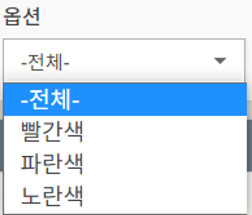
<center><그림> 적용된 화면 결과 예시<br></center>
<br>


만약 BoxTag.draw라면 type지정 필요
여러 box tag들을 혼합해서 사용하는 경우 type을 지정하는 방식을 사용한다. 

```javascript
BoxTag.draw([  //기존 BoxTag.selectBox.draw에서 selectBox가 생략됨
                {
                    selector : "#optionCd"
						, type: "selectBox"  //타입을 따로 지정
                    , firstTxt : "<s:interpret word='-전체-'/>"
                    , masterCd : "option_cd"
                    }
                }
,{
                    selector : "#delYn"
                    , firstTxt : "<s:interpret word='-전체-'/>"
                    , type : "multiCheck" //타입을 따로 지정
                    , masterCd : "del_yn"
                 }
]);
```
<center><그림> BoxTag.draw타입 지정 예시<br></center>
<br>

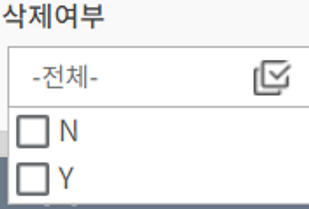
<center><그림> multiCheck타입 결과 화면 예시<br></center>
<br><br><br>


## 3.3.1 code_master, code_slave 를 사용하는 방식 
code_slave(테이블명) 안에 있는 master_cd와 같은 것을 조회 후 <br>
slave_cd를 key값,   slave_name을  value값으로 사용 한다.<br>
masterCd : (적용할 master_cd 이름)<br>
(예시는 위 예시 코드와 같다 )
<br>
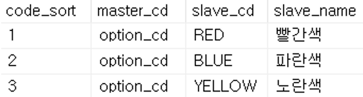
<center><그림> master_cd 테이블 예시<br></center>
<br><br><br>


## 3.3.2 serviceName 사용 방식 
Controller Mapping 에 지정한 name 값을 serviceName에 사용한다.<br>
serviceName : (적용할 name)

```javascript
BoxTag.draw([
                {
                    selector : "#itemTypeId"
                    , firstTxt : "<s:interpret word='-전체-'/>"
                    , serviceName : "itemType"  //서버 Controller 에서 구현한 name을 지정
                    , value : "itemTypeId"  //실제 서버와 통신하는 값
                    , text : "itemTypeName" //화면상으로 보여지는 값
                    , type : "selectBox"
                }
            ]);
```
<center><그림> serviceName 사용 예시<br></center>
<br>

```java
@PostMapping(value = { "/getList" }, name="itemType")
    public List<ItemTypeDTO> getList(ItemTypeDTO dto) {
        dto.setDelYn(SfpConst.YN_N);
        return itemTypeService.getList(dto);
    }
```
<center><그림> BoxController Mapping 예시<br></center>
<br><br><br>

## 3.3.3 tableNm 사용 방식 
값에 변화가 자주 일어나지 않는 항목들은 매번 쿼리문으로 불러오지 않고 메모리에  저장된 값을 불러와서 사용한다.<br>
값이 변하면 reload를 해야 바뀐 값이 적용된다.<br>
memory-table xml 파일에 구현한 key, value 값으로 데이터를 불러온다.<br>
tableNm : (적용할 테이블이름)<br>

```javascript
BoxTag.draw([
                {
                    selector : "#itemTypeId"
                    , firstTxt : "<s:interpret word='-전체-'/>"
                    , tableNm : "wmd_item_type"  //memory xml에 구현한 table name
                    , value : "item_type_id" //실제 서버와 통신하는 값(언더바 형식 사용, 카멜케이스 X)
                    , text : "item_type_name"//화면상으로 보여지는 값(언더바 형식 사용, 카멜케이스 X)
                    , type : "selectBox"
                }
]);
```
<center><그림> tableNm 사용예시<br></center><br>
<br>

```xml
<tables>
    <table name="wmd_item_type">
        <keys>
            <key>itemTypeId</key>
        </keys>
        <value>itemTypeName</value>
    </table>
</tables>
```
<center><그림> memory xml 예시<br></center><br>


## 3.3.4 BoxTag 옵션 (sfp-ui-box.js)
1. selector : 화면에서 사용할 선택자(selector: “#selectTest”,)
2. serviceName : 서비스ID, 어떻게 코드를 호출할 것인지 boxController의 name = ui-box.js의 serviceName 이름만을 가지고 컨트롤러를 호출한다.
3. firstTxt : 최초의 Text (selectedValue가 없다면 가장 먼저 나오는 항목) 
4. masterCd : 대분류 코드 (조회 시 필요한 코드 그룹)
5. value : value로 사용할 키 (slaveCd)
6. text : text로 사용할 키 (slaveNm)
7. tableNm : 조회할 메모리 테이블명 (직접 DB에서 조회 하지 않음)
8. selectedValue : Box에서 선택할 값이다. ex) selectBox에서는 selectedValue로 지정한 값이 가장 먼저 보여 진다.<br>
            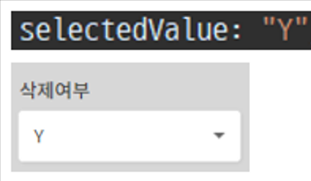
            <center><그림> selectValue  예시<br></center>
9. removeValue : Box에서 삭제할 값, 해당 값이 삭제된 Box로 나온다.<br>
            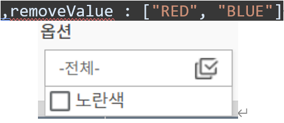
            <center><그림> removeValue  예시<br></center>
10. children : select에서 값의 연계가 필요한 경우 (children에 또 다시 BoxTag를 정의 -> children : “BoxTagName”) (List안에 List 존재)<br>
Ex) 연속된 selectBox A, B, C가 연계되어 있다.
=> (주소) select A : 도,특별시 / select B : 시,군,구 / select C :  읍,면,동 ( B는 A에 종속, C는 B에 종속 )
11. vertical : (true : 세로/ false : 가로) – checkBox와 radioBox일 때 유효하다.<br>
            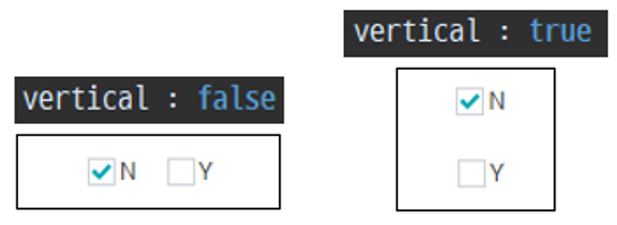
            <center><그림> vertical   예시<br></center>
12. type : BoxTag가 가지고 있는 값의 타입 (기본 : checkbox/radioBox) + selectBox
13. params : 서버와 통신하는 params
14. callFn : 단일 처리 후 리턴 되면 해당 데이터만 전달
15. filter : 리턴 true 일 경우만 보여짐<br> filter가 먼저 처리되어 데이터를 걸러준 후에 callFn 호출

```javascript
, masterCd : "option_cd"
, filter : function(data){
    return data.codeSort != "1"; //codeSort가 1이 아닌 경우만 나온다
}

 ```
 <center><그림> filter 사용 예시<br></center><br>

 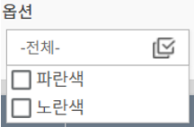(code_sort가 1인 빨간색RED는 나오지 않음)<br>
<center><그림>filter결과 화면 예시<br></center><br>


## 6. DateUtils

<br>

## 6.1 날짜 형식 반환 함수

<br>

## 6.1.1 fnDateToYmdhms
Date객체를 문자열로 반환 (yyyy-mm-dd hh:mm:ss)
```javascript
var d = new Date;
var result = DateUtils.fnDateToYmdhms(d);
console.log(d);
console.log(result);
```
<center><그림> fnDateToYmdhms 예시 코드<br></center>
<br>
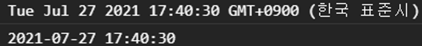
<center><그림> fnDateToYmdhms 예시 결과<br></center>
<br><br><br>


## 6.1.2 fnDateToYmdhms14 
Date객체를 문자열로 반환 (yyyymmddhhmmss)
```javascript
var d = new Date;
var result = DateUtils.fnDateToYmdhms14(d);
console.log(d);
console.log(result);
```
<center><그림> fnDateToYmdhms14  예시 코드<br></center>
<br>
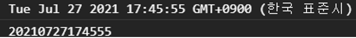
<center><그림> fnDateToYmdhms14  예시 결과<br></center>
<br><br><br>

## 6.1.3 fnYmdhms 
Date 객체이거나 문자열을  yyyy-mm-dd hh:mm:ss 형식으로 반환
```javascript
var d = new Date;
var str = "20210204055436";
var result = DateUtils.fnYmdhms(d);
var result2 = DateUtils.fnYmdhms(str);

console.log(result);
console.log(result2);
```
<center><그림> fnYmdhms  예시 코드<br></center>
<br>
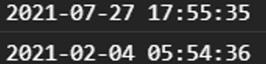
<center><그림> fnYmdhms  예시 결과<br></center>
<br><br><br>

## 6.1.4 fnYmd 
Date객체나 문자열 형식의 날짜를 yyyy-mm-dd 형식으로 반환한다.<br>
(매개변수가 없으면 현재시간을 반환)

```javascript
DateUtils.fnYmd()
"2021-07-28"
```
<center><그림> fnYmd코드와 결과 예시<br></center>
<br><br><br>

## 6.1.5 fnToDate 
날짜형식의 문자열을 Date 객체로 변환한다. 

```javascript
DateUtils.fnToDate("20210723151515")
```
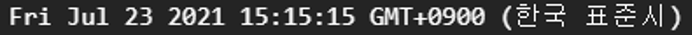
<center><그림> fnToDate코드와 결과 예시<br></center>
<br><br><br>

## 6.1.6 fnNowYmdhms14 
yyyymmddhhmmss 형식의 현재일시를 반환한다.

```javascript
DateUtils.fnNowYmdhms14()
"20210728095504"
```
<center><그림> fnNowYmdhms14코드와 결과 예시<br></center>
<br><br><br>


## 6.1.7 fnDateToYmdhms14, fnDateToYmdhms 
Date객체를 fnDateToYmdhms14는 yyyymmddhhmmss,<br>
fnDateToYmdhmss는 yyyy-mm-dd hh:mm:ss 형식으로 반환한다.


```javascript
DateUtils.fnDateToYmdhms14(d)
"20210728100225"
DateUtils.fnDateToYmdhms(d)
"2021-07-28 10:02:25"
```
<center><그림> fnDateToYmdhms14, fnDateToYmdhms 코드와 결과 예시<br></center>
<br><br><br>


## 6.1.8 fnFormatToYmdhms, fnFormatToYmdhm, fnFormatToYmd, fnFormatToHms
yyyymmddhhmmss형식의 문자열을 fnFormatToYmdhms는 yyyy-mm-dd hh:mm:ss<br>
fnFormatToYmdhm은 yyyy-mm-dd hh:mm, <br>
fnFormatToYmd는 yyyy-mm-dd,<br>
fnFormatToHms는 hh:mm:ss 형식으로 반환 (매개변수가 없으면 현재시간 적용)


```javascript
DateUtils.fnFormatToYmdhms()
"2021-07-28 10:10:58"
DateUtils.fnFormatToYmdhm()
"2021-07-28 10:11"
DateUtils.fnFormatToYmd()
"2021-07-28"
DateUtils.fnFormatToHms()
"10:11:18"
```
<center><그림> fnFormatToYmdhms, fnFormatToYmdhm,  fnFormatToYmd, fnFormatToHms코드와 결과 예시<br></center>
<br><br><br>


## 6.1.9 fnRefinYmdHms14
문자열에서 “-”, “:”, “ “ 제거


```javascript
DateUtils.fnRefineYmdHms14("2021-05-25")
"20210525"
DateUtils.fnRefineYmdHms14("2021:05:25")
"20210525"
DateUtils.fnRefineYmdHms14("2021 05 25")
"20210525"
```
<center><그림> fnRefinYmdHms14코드와 결과 예시<br></center>
<br><br><br>

## 6.2 날짜 부분 반환 함수

<br>

## 6.2.1 fnYyyy, fnMm, fnDd
Date객체나 문자열 형식의 날짜를 fnYyyy 는 yyyy(년도),  fnMm은 mm(월),
fnDd는 dd(일) 로 반환한다. (매개변수가 없으면 현재시간을 반환)


```javascript
DateUtils.fnYyyy()
"2021"
DateUtils.fnMm()
"07"
DateUtils.fnDd()
"28"
```
<center><그림> fnYyy, fnMm, fnDd코드와 결과 예시<br></center>
<br><br><br>


## 6.2.2 fnYm, fnMd, fnDm
Date객체나 문자열 형식의 날짜와 구분자를 정해서 fnYm은 yyyy(구분자)mm
fnMd 는 mm(구분자)dd,  fnDm은 dd(구분자)mm 형식으로 반환한다.
(매개변수가 없으면 현재시간을 반환, 구분자가 없으면 “-“을 기본값으로 한다)

```javascript
var d = new Date;
DateUtils.fnYm(d, "/");
2021/07
DateUtils.fnDm(d, ".");
28.07
DateUtils.fnMd();
07-28
```
<center><그림> fnYm, fnMd, fnDm코드와 결과 예시<br></center>
<br><br><br>

## 6.3 날짜 데이터 배열 반환 함수

<br>

## 6.3.1 fnToArray 
yymmddhhmmss 형식의 문자열을  [yyyy, mm, dd, hh, mm, ss] 형식의 배열로 나누어  반환한다.
```javascript
DateUtils.fnToArray("20210727055656");
(6) ["2021", "07", "27", "05", "56", "56"]
```
<center><그림> fnToArray 코드와 결과 예시<br></center>
<br><br><br>


## 6.3.2 fnYmdhmsArray 
Date객체나 문자열 형식의 날짜를 [yyyy, mm, dd, hh, mm, ss] 형식의 배열로 나누어  반환한다. (만약 매개변수가 없으면 현재시간을 반환한다.
```javascript
var result = DateUtils.fnYmdhmsArray();
console.log(result);
(6) ["2021", "07", "28", "09", "16", "47"]
```
<center><그림> fnYmdhmsArray 코드와 결과 예시<br></center>
<br><br><br>


## 6.3.3 fnHHMMSStoArray 
날짜형식의 문자열을 [hh, mm, ss] 형식의 배열로 반환한다.
```javascript
DateUtils.fnHHMMSStoArray("2021 05 25")
(3) ["20", "21", "05"]
```
<center><그림> fnHHMMSStoArray 코드와 결과 예시<br></center>
<br><br><br>


## 6.3.3 fnGetBetweenYmd 
두 날짜 사이의 모든 날짜들을 yyyy-mm-dd 형식의 배열로 반환한다.
```javascript
DateUtils.fnGetBetweenYmd("2021-07-25", "2021-07-28")
(4) ["2021-07-25", "2021-07-26", "2021-07-27", "2021-07-28"]
```
<center><그림> fnGetBetweenYmd 코드와 결과 예시<br></center>
<br><br><br>

## 6.4 날짜 데이터 계산 함수

<br>

## 6.4.1 fnDiffSecond
두 날짜의 차이를 계산한다.
```javascript
var d1 = "20210204055436";
var d2 = "20210204055439";
DateUtils.fnDiffSecond(d1, d2);
-3
```
<center><그림> fnDiffSecond 코드와 결과 예시<br></center>
<br><br><br>


## 6.4.2 fnMinToHHMM, fnSecToHHMMSS
fnMinToHHMM은 seconds(초)를 을 hh:mm 형식으로 계산한다.<br>
fnSecToHHMMSS는 seconds(초)를 hh:mm:ss 형식으로 계산한다.

```javascript
DateUtils.fnMinToHHMM(365)
"00:06"
DateUtils.fnSecToHHMMSS(365)
"00:06:05"
```
<center><그림> fnMinToHHMM, fnSecToHHMMSS코드와 결과 예시<br></center>
<br><br><br>


## 6.4.3 fnHhmmssToSec
hh:mm:ss 형식의 문자열을 seconds(초)로 계산하여 반환

```javascript
DateUtils.fnHhmmssToSec("01:01:01")
3661
```
<center><그림> fnHhmmssToSec 코드와 결과 예시<br></center>
<br><br><br>


## 6.4.4 fnAddTime
매개변수를 3개를 받아와 시간을 더한 계산값을 yyyy-mm-dd hh:mm:ss 형식으로 반환한다.<br>
첫번째 매개변수 : 계산범위로 s(초), m(분), h(시), d(일) 중 하나를 선택한다.<br>
두번째 매개변수 : yyyymmddhhmmss형식의 문자열 날짜<br>
세번째 매개변수 : 더하고 싶은 값<br>
```javascript
DateUtils.fnAddTime("s", "20210728105136", "1")
"2021-07-28 10:51:37"
DateUtils.fnAddTime("m", "20210728105136", "2")
"2021-07-28 10:53:36"
DateUtils.fnAddTime("h", "20210728105136", "3")
"2021-07-28 13:51:36"
DateUtils.fnAddTime("d", "20210728105136", "4")
"2021-08-01 10:51:36"
```
<center><그림> fnAddTime코드와 결과 예시<br></center>
<br><br><br>