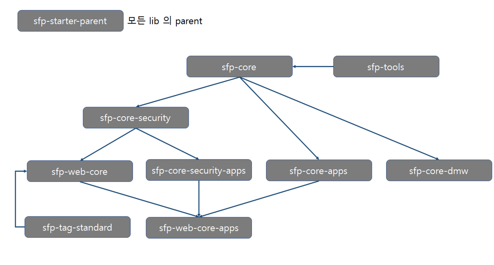

<style type='text/css'>
  [class*="table"] {text-align:center;}
</style>

# 1. SFP 라이브러리
SFP 는 현재 java 11 버전을 사용하고 있으며, SFP의 라이브러리 구성은 다음과 같다.
<br><br>

<center><그림> SFP 라이브러리 구성도<br></center>
<br>

## 1.1	sfp-starter-parent
SFP에서 사용하는 각 lib 버전을 관리하며, spring-boot-starter-parent 와 연결되어 있다. (java version 도 관리한다)
<br>

|artifactId|버전 
|------|---
|sfp-starter-parent|3.6.x

pom.xml 설정
```xml
<dependency>
	<groupId>com.s3s.sfp</groupId>
	<artifactId>sfp-core</artifactId>
</dependency>
```

<br>


## 1.2	sfp-core
SFP의 서비스 개발의 위한 기본 구조 및 기능 제공한다.<br>
화면(view)이 없는 단독 rest-api 개발인 경우에 직접 연계하여 사용할 수도 있다.<br>
화면(view) 필요한 경우 sfp-web-core 또는 sfp-web-core-apps 를 사용하며, 해당 라이브러리는 sfp-core 를 기반으로 한다.
<br>

|artifactId|버전 
|------|---
|sfp-core|sfp-starter-parent에서 관리됨

```xml
<dependency>
	<groupId>com.s3s.sfp</groupId>
	<artifactId>sfp-core</artifactId>
</dependency>
```

## 1.3	sfp-tools
편의성을 위한 util들을 제공하는 라이브러리이다.
<br>

|artifactId|버전 
|------|---
|sfp-tools|sfp-starter-parent에서 관리됨

```xml
<dependency>
	<groupId>com.s3s.sfp</groupId>
	<artifactId>sfp-tools</artifactId>
</dependency>
```
<br>

## 1.4	sfp-core-security
SFP의 서비스의 인증관련 라이브러리이다. 데이터베이스의 메뉴 및 사용자를 데이터베이스로 사용하지 않는 경우에만 단독으로 사용한다. 단독인 경우 menu.xml(파일) 로 메뉴를 설정할 수 있다.
<br>

|artifactId|버전 
|------|---
|sfp-core-security|sfp-starter-parent에서 관리됨

```xml
<dependency>
	<groupId>com.s3s.sfp</groupId>
	<artifactId>sfp-core-security</artifactId>
</dependency>
```
<br>

## 1.5	sfp-core-security-apps
SFP의 서비스의 인증관련 라이브러리이다. 데이터베이스로 메뉴 및 사용자를 관리할 수 있다. 모드는 3가지이며(no-auth, auth, role-auth), 모드 설정 및 내용은 프로퍼티에서 기술되어 있다.
<br>

|artifactId|버전 
|------|---
|sfp-core-security|sfp-starter-parent에서 관리됨

```xml
<dependency>
	<groupId>com.s3s.sfp</groupId>
	<artifactId>sfp-core</artifactId>
</dependency>
```
<br>

## 1.6	sfp-core-apps
SFP의 서비스 중 기본적으로 많이 쓰는 기능들이 구현되어 있는 라이브러리이다.
코드관리, 이력관리, 휴일관리 등이 구현되어 있다.
<br>

|artifactId|버전 
|------|---
|sfp-core-apps|sfp-starter-parent에서 관리됨

```xml
<dependency>
	<groupId>com.s3s.sfp</groupId>
	<artifactId>sfp-core-apps</artifactId>
</dependency>
```
<br>

## 1.7	sfp-core-dmw
modbus-tcp, modbus-rtu, opc-ua 등의 통신에 관한 라이브러리이다. 
@ EnableDMW로 활성화시킬 수 있으며, configurable을 상속하여 필요한 프로퍼티 로드 방식을 프로젝트에 맞게 변경이 가능하다. 현재는 DBConfiguration 이 구현되어 있다.
<br>

|artifactId|버전 
|------|---
|sfp-core-dmw|sfp-starter-parent에서 관리됨

```xml
<dependency>
	<groupId>com.s3s.sfp</groupId>
	<artifactId>sfp-core-dmw</artifactId>
</dependency>
```
<br>


## 1.8 sfp-web-core
라이브러리들의 UI 가 구현되어 있으며, 화면의 구조를 관리하는 라이브러리이다. 
화면이 필요한 프로젝트는 apps의 필요여부에 따라 sfp-web-core 또는 sfp-web-core-apps를 dependency 한다.
<br>

|artifactId|버전 
|------|---
|sfp-web-core|sfp-starter-parent에서 관리됨

```xml
<dependency>
	<groupId>com.s3s.sfp</groupId>
	<artifactId>sfp-web-core</artifactId>
</dependency>
```
<br>


## 1.9 sfp-web-core-apps
라이브러리들의 UI 가 구현되어 있으며, 화면의 구조를 관리하는 라이브러리이다. 
화면이 필요한 프로젝트는 apps의 필요여부에 따라 sfp-web-core 또는 sfp-web-core-apps를 dependency 한다.
<br>

|artifactId|버전 
|------|---
|sfp-web-core-apps|sfp-starter-parent에서 관리됨

```xml
<dependency>
	<groupId>com.s3s.sfp</groupId>
	<artifactId>sfp-web-core-apps</artifactId>
</dependency>
```
<br>
<br>


## 2. Profile

Spring Profile을 통해 런타임 환경을 설정할 수 있는 기능을 제공한다. 이 기능을 활용하여 개발, 운영 환경(DB, 외부 interface URL등)을 쉽게 전환가능 하다.
SFP에서 런타임 환경 관련 Profile, 권한 환경 관련 Profile로 구분한다.

<br>
<center>

|Profile|설명 
|:-----:|:---:
|dev|개발 환경에서 사용하는 Profile
|stage|운영 환경 전 테스트 시 사용하는 Profile
|prod|운영 환경에서 사용하는 Profile

</center>
<center><표> 런타임 환경 Profile<br></center>
<br><br>

<center>

|Profile|설명|로그인 여부
|:-----:|:---:|:---:
|no-auth|권한 설정을 하지 않는 Profile|X
|auth|로그인 시 모든 권한이 허용되는 Profile|O
|role-auth|로그인 된 사용자의 권한에 따라 해당 권한만 허용이 되는 Profile|O

</center>
<center><표> 런타임 환경 Profile<br></center>

<br><br><br>
Profile 설정: **/프로젝트/src/main/resources/application.yml**<br><br>
application.yml
```yml
spring:
profiles:
    active:
      - dev
- no-auth
…
```
런타임 환경 Profile에 따라 application-{profile}.yml과 configprops-{profile}.yml에 설정이 load되어 런타임 환경이 설정됩니다.
<br><br><br>


## 3. Properties
Spring 관련 Properties 설정: **/프로젝트/src/main/resources/application.yml**<br>
SFP 관련 properties설정: **/프로젝트/src/main/resources/configprops.yml**
<br><br>
configprops.yml
```yml
server:
properties:
locale: ko
menu-disabled-display-type: HIDE
site-code: DMS
site-name: DMS
site-version: 1.0
theme: factory
view-menu-location: tmpage
sfp-thread-pool:
task:
core-pool-size: 20
max-pool-size: 50
queue-capacity: 30
thread-name-prefix: 'sfp-task-pool'
scheduler:
pool-size: 10
thread-name-prefix:  'sfp-scheduler-pool-'
security:
properties:
jwtHeader: 'X-AUTH-TOKEN'
interfaceId: 's3sInterface'
interfacePw: '@interface.com'
passFolder: 
- '/apps/common'
- '/apps/sys/common'
success-page: '/common/index'
superUserId: 'admin'
superUserPw: '@s3s.com'
hmiSerial : '@s3s.com'
```


<center>
<br><br><br>
<table class="table">
<tr >
    <th class="table" colspan="3">Properties 항목</th><th class="table">Properties 기본값</th><th class="table">Properties 데이터 유형</th><th class="table">설명</th>
</tr>
<tr>
    <td rowspan="8">server</td>
    <td rowspan="8">properties</td>
    <td>locale</td>
    <td>ko</td>
    <td>ko(한글)/en(영문)/cn(중문) 등</td>
    <td>기본 Locale 설정</td>
</tr>
<tr>
    <td>menu-xml-dir</td>
    <td>config/settings/menu/menu.xml</td>
    <td></td>
    <td>메뉴 xml 사용시 xml 경로</td>
</tr>
<tr>
    <td>menu-disabled-display-type</td>
    <td>DISABLED</td>
    <td>DISABLED – 비활성화<br>HIDE – 숨김</td>
    <td>권한 없는 메뉴에 대한 처리 방안<br>
        DISABLED – 비활성화 처리<br>
        HIDE – 숨김 처리<br>
    </td>
</tr>
<tr>
    <td>site-code</td>
    <td>프로젝트 명</td>
    <td></td>
    <td>해당 사이트 Code 값</td>
</tr>
<tr>
    <td>site-name</td>
    <td>프로젝트 명</td>
    <td></td>
    <td>해당 사이트 이름</td>
</tr>
<tr>
    <td>site-version</td>
    <td>프로젝트 버전</td>
    <td></td>
    <td>해당 사이트 Version</td>
</tr>
<tr>
    <td>theme</td>
    <td>factory</td>
    <td>basic/factory</td>
    <td>테마 별로 CSS가 변경<br>
    (basic/factory – 기본 factory)
    </td>
</tr>
<tr>
    <td>view-menu-location</td>
    <td>ltmpage</td>
    <td>page/lmpage/ltmpage<br>
    * Front End 2. tiles 참고
    </td>
    <td>설정된 tiles template으로 화면 호출</td>
</tr>
<tr>
    <td rowspan="6">sfp-thread-pool</td>
    <td rowspan="4">task</td>
    <td>core-pool-size</td>
    <td>20</td>
    <td></td>
    <td>동시에 실행시킬 Thread 개수</td>
</tr>
<tr>
    <td>max-pool-size</td>
    <td>50</td>
    <td></td>
    <td>Thread pool 최대 개수</td>
</tr>
<tr>
    <td>queue-capacity</td>
    <td>30</td>
    <td></td>
    <td>Thread pool 큐 개수</td>
</tr>
<tr>
    <td>thread-name-prefix</td>
    <td>sfp-task-pool</td>
    <td></td>
    <td>Thread 이름 prefix</td>
</tr>
<tr>
    <td rowspan="2">scheduler</td>
    <td>pool-size</td>
    <td>10</td>
    <td></td>
    <td>Scheduler pool 개수</td>
</tr>
<tr>
    <td>thread-name-prefix</td>
    <td>sfp-scheduler-pool</td>
    <td></td>
    <td>Scheduler 이름 prefix</td>
</tr>
<tr>
    <td>security</td>
    <td>properties</td>
    <td>jwtHeader</td>
    <td>X-AUTH-TOKEN</td>
    <td></td>
    <td>인터페이스 JWT 발행 요청 시 해당 key</td>
</tr>
</table>

</center>
<center><표> configprops.xml SFP properties 설명<br></center>